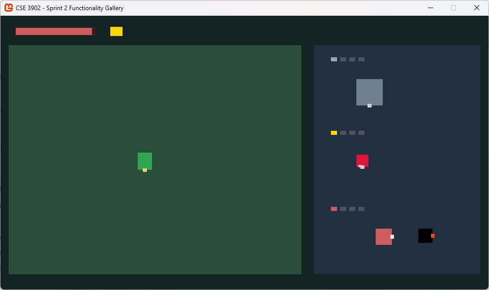

# Enemies/NPCs: Starlight Ruins roster

## Current paired gallery

The preview at (700,420) and the play-area copy at (370,450) use the same update timing and selection. O/P cycles all seven entries, and R resets both copies and hidden entries, including shots.

| Display name | Behavior |
|---|---|
| Octorok | Existing horizontal patrol and periodic shots |
| Keese | Existing bounded figure-eight flight |
| Gel | Existing pause/hop cycle |
| Lantern Keeper | Existing Npc implementation; stationary |
| Rune Wisp | New elliptical floating path and flickering accents |
| Clockwork Beetle | New rectangular patrol with four facing directions |
| Prism Sentinel | New stationary charge and alternating right/left light shots |

EnemyObject preserves its original factory constructor and adds sprite injection for headless verification. New enum values are appended. The three new behaviors are separate EnemyCharacter subclasses, and every object still draws through ISprite.

The sentinel charges from 1.2 seconds into each two-second cycle, then fires. A shot lasts at most 0.6 seconds. Its 8-pixel light-bolt motif and movement envelope fit both current panels. Timers use elapsed game time; Draw does not advance state. New shots do not interact with the player or other objects.

## Automated checks

```sh
bash scripts/verify.sh
dotnet run --project tests/Enemies/Enemies.Tests.csproj --configuration Release
```

The original four-character regression checks remain. RuinsEnemyChecks adds coverage for new movement envelopes over 120 seconds, frame partition independence, charge/shot boundaries, all four beetle patrol legs, actual EnemyObject routing for all seven kinds, paired draw calls, gallery wraparound, and hidden resets.

## Manual checks — complete before visual acceptance

1. Cycle P through all seven entries. O from Octorok should reach Prism Sentinel.
2. Observe matching movement and animation in the side preview and green play area.
3. Wait on Rune Wisp and Clockwork Beetle long enough to see their different paths.
4. Wait on Prism Sentinel for at least four seconds: observe charge, a right shot, then a left shot. Shots should disappear inside the panels.
5. Change selection during a shot, press R, and revisit the sentinel. It should start at rest with no shot and wait a fresh interval.
6. Confirm 1/2/3, WASD/arrows, other galleries, and Q/Escape still work.
7. Capture a screenshot/GIF after testing. The automated suite cannot establish visual quality or real keyboard behavior.

## Earlier visual evidence

The following existing screenshot belongs to the earlier Octorok implementation, not the expanded seven-character roster:



Original feature branch: feature/enemies-npcs; its requested reviewer was @Lzzz-7. Earlier review or screenshots do not automatically cover these new objects.
