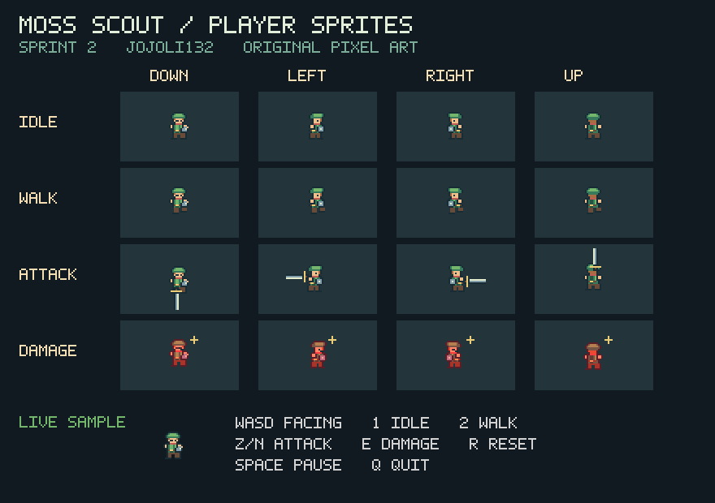
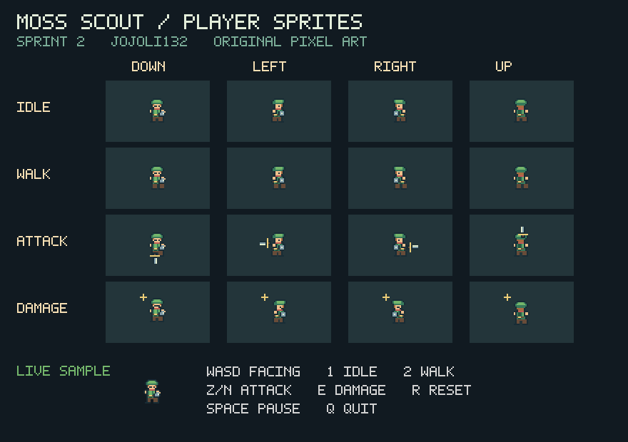

# Player sprites and asset attribution

Owner: @JojoLi132  
Branch: `feature/player-sprites`  
Issue: [#9](https://github.com/hankkyy/CSE3902-Game-Project/issues/9)  
Reviewer: @hankkyy

## What is implemented

The player factory now returns a textured sprite using the original **Moss Scout** atlas instead of a colored rectangle. The scout is a green-clad, top-down adventurer with a red scarf, round buckler, and a short sword. It provides the requested Link-style game role without importing Nintendo artwork.

The atlas has 16 directional clips: Idle, Walking, Attacking, and Damaged, each facing Down, Left, Right, and Up. There are 44 distinct active frames. The 40-pixel cells include transparent space for the sword and recoil. At scale 2, the body retains the starter's 28 by 34 pixel footprint and top-left positioning convention.

| Animation | Frames | Seconds per frame | Behavior |
| --- | --- | --- | --- |
| Idle | 2 | 0.45 | Loops with a small scarf detail change |
| Walking | 4 | 0.10 | Loops with alternating feet and body movement |
| Attacking | 3 | 0.09 | Wind-up, extension, recovery; holds the last frame until caller changes state |
| Damaged | 2 | 0.075 | Recoil, impact marks, and alternating red tint |

The player remains responsible for action duration, damage invulnerability, blinking, movement, and reset. `Draw` only samples a supplied clip time; it never polls input, advances a timer, or starts/ends a SpriteBatch.

## Attribution and license

- Asset: `GameProject/Content/Player/moss-scout.png`.
- Source: original pixel patterns and geometry in the adjacent `generate_atlas.py`, created for this branch with OpenAI Codex assistance on 2026-09-27 under @JojoLi132's direction.
- Third-party art: none. No ripped, traced, recolored, downloaded, or extracted Nintendo sprites are included.
- License for the original atlas, pixel patterns, and test-host bitmap labels: **CC0-1.0**. To the extent rights exist in these newly created assets, they are dedicated to the public domain under [CC0 1.0](https://creativecommons.org/publicdomain/zero/1.0/).
- The attribution describes the new assets only; it does not relicense the pre-existing repository, MonoGame, or Nintendo trademarks.
- `moss-scout.json` records layout, timing, and the PNG SHA-256. `check_assets.py` verifies the metadata and embedded copy.

## Loading and content pipeline

`SpriteFactory(GraphicsDevice)` loads an identical base64-encoded PNG from `PlayerSpriteAtlasData.g.cs`. The factory shares one atlas texture across all its player sprites. The existing construction call works from any working directory and does not require a new package, copied output asset, or edit to the frozen project file.

`GameProject/Content/Content.mgcb` contains a real `TextureImporter` / `TextureProcessor` entry for the same PNG, with color key and mipmaps disabled, premultiplied alpha enabled, and the color texture format. The entry was built separately with MGCB 3.8.5.1 (one succeeded, zero failed). The `.xnb` output is ignored and is not committed.

**The production csproj does not yet invoke MGCB.** Automatic pipeline wiring belongs to the integrator, because this branch cannot add build packages or edit the project file. The embedded image keeps the branch independently runnable while that wiring is pending. See the [integration proposal](../architecture-proposals/player-sprites.md).

Regenerate the authored PNG, metadata, and C# copy from the repository root:

```sh
python GameProject/Content/Player/generate_atlas.py
python tests/PlayerSprites/check_assets.py
```

These optional authoring checks use Pillow. Python and Pillow are not needed to build or run the game. No new game package is added.

To verify the pipeline entry with an independently installed MGCB 3.8.5.1:

```sh
cd GameProject/Content
mgcb /@:Content.mgcb
```

## Compatibility and integration status

The original `ISprite.Draw(SpriteBatch, Vector2, Direction, bool)` is unchanged. `CreatePlayerSprite()` still returns `ISprite`; all block, item, and enemy factories keep their old signatures and implementations.

The starter's boolean cannot distinguish a walking frame from an attack or damage frame, and it does not contain elapsed time. The compatibility adapter uses the first idle frame for `false` and the second walk frame for `true`. Thus the unchanged production `Player` immediately gets the new art and its existing two-frame animation and damage blinking, but **does not yet select the full attack/damage clips or four-frame walking animation**.

The additive `IAnimatedPlayerSprite : ISprite` and `CreateAnimatedPlayerSprite()` expose explicit visual state and elapsed seconds without changing a frozen interface. All sixteen clips are demonstrated in the isolated acceptance host. The player-state owner must connect that overload to their state machine. This branch does not infer state from position, use a global player reference, inspect another owner's private fields, or change another owner's files.

## Verification and evidence

See [the executable checks and exact visual test steps](../../tests/PlayerSprites/README.md).





The image and GIF were captured from `RenderTarget2D` in the real MonoGame test host. They demonstrate the sprite subsystem, not completed player-state integration in the production game. Automated rendering and command/reset smoke tests were run; physical keyboard interaction remains a reviewer manual check.

## Course deadline note

The live [Canvas Sprint 2 assignment](https://osu.instructure.com/courses/220406/assignments/5669396), checked on 2026-09-27, shows **October 5, 2026 at 8:00 PM**. The repository plan currently says September 28 and the attached HTML contains older February dates. This branch records the discrepancy without editing shared schedule files or submitting the team's assignment.
